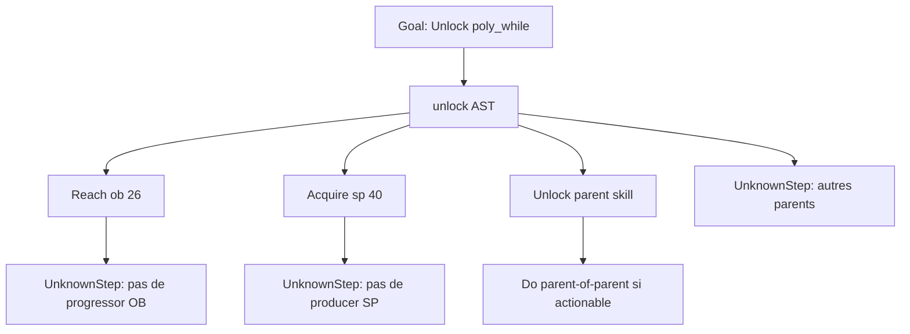

# Architecture du moteur de progression

Document de conception vivant (étapes A–J1 implémentées ; J2/K = suite).
Ce fichier fige les ajustements validés. L’UI et `app.js` restent **non branchés** tant que K n’est pas ouverte.

Il complète la proposition déjà validée (graphe compilé depuis les catalogues, `PlayerView`, AST de conditions, fragments wiki, axes plutôt qu’une priorité unique). Seules les sections ci-dessous **remplacent** les parties correspondantes de cette proposition.

---

## Ce qui ne change pas

- Le graphe de prérequis (`Node.unlock` → AST `Condition`) reste la source de vérité des **dépendances**.
- L’AST existant suffit : `all`, `any`, `node(id, min)`, `stat`, `resource`, `unknown`.
- Les catalogues UI (`skillsData`, fishing, etc.) ne sont pas réécrits. Le graphe se compile **à côté**.
- On n’invente pas d’arêtes wiki, ni de producteurs de ressources IOM, tant que les données ne sont pas dans l’application. On pose `unknown` (ou un index `produces` / `progresses` vide).
- Certification d’une arête :
  - **Explicit** — écrite comme telle par une source (table, phrase wiki, catalogue).
  - **Derived** — non écrite comme arête, mais déductible de contraintes documentées, et validée par des tests. Ce n’est pas `unknown`.
  - **Unknown** — aucune conclusion fiable : `unknown` / `UnknownStep`, jamais `available` artificiel.
- `capMod` n’est pas un unlock.
- Confiance `confirmed | partial | unknown` : **conservée**, mais désormais **orthogonale** au statut de progression (plus de fusion implicite avec « probable / données insuffisantes » côté reco).

---

## 1. Modèle final des statuts

L’évaluation d’une cible (nœud, condition ou objectif) retourne **deux champs indépendants** :

```text
Evaluation = {
  status:     unlocked | available | locked | blocked | incomplete | unknown
  confidence: confirmed | partial | unknown
  actionable: boolean              // dérivé, jamais un statut exclusif
  knownSatisfied:    Condition[]   // feuilles requises connues et vraies
  knownUnsatisfied:  Condition[]   // feuilles requises connues et fausses
  unknownRequired:   Condition[]   // feuilles requises encore inconnues
  unknownOptional:   Condition[]   // trous non bloquants (OR alternatif, hint, effet)
}
```

`actionable` est une **propriété dérivée**, pas une valeur de `status` :

```text
status: available
confidence: confirmed
actionable: true
```

Cela sépare : l’accès (`available`) · la connaissance (`confidence`) · la possibilité réelle de l’effectuer maintenant (`actionable`).

```text
actionable ⇔ status === 'available'
            && kind === 'action'
            && coût connu et payable (cost.truth === 'true')
```

Un trou `unlock` requis interdit `available`, donc interdit aussi `actionable`. Un trou optionnel (`any` déjà satisfait) peut laisser `available` + `confidence: partial` + `actionable: true`.

### 1.1 Statut de progression (`status`)

| Statut | Signification | Ce que l’UI a le droit de dire |
|---|---|---|
| **unlocked** | Déjà possédé / déjà atteint (seuil déjà vrai). | « Tu as déjà ça. » |
| **available** | Toutes les conditions d’**accès** (`unlock`) sont **connues et satisfaites**. Le nœud n’est pas encore possédé. Les coûts peuvent encore manquer. | « Les prérequis d’accès connus sont remplis. » — **pas** « tu peux le faire maintenant » si `actionable` est faux. |
| **locked** | Au moins une condition d’accès requise **connue** est fausse, mais encore éventuellement rattrapable. | « Il manque X » (X est documenté). |
| **blocked** | Condition requise connue **et irréversible** depuis l’état actuel (choix exclusif déjà pris, branche fermée). À n’utiliser que si l’impossibilité est documentée. Sinon : `locked`. | « Ce n’est plus possible depuis ton état actuel. » |
| **incomplete** | Aucune condition d’accès requise connue n’est fausse, **mais** au moins une condition requise est `unknown`. Analyse partielle possible. | « Les conditions connues sont remplies, mais certains prérequis ne sont pas encore documentés dans l’application. » |
| **unknown** | La cible elle-même n’est pas dans le graphe, ou on n’a aucune condition évaluable. | « L’application ne connaît pas encore cet élément. » |

`actionable: true` (propriété, pas un statut) : « Tu peux faire cette action maintenant. » Uniquement si `status === available`, `kind === action`, coût connu et payable.

**Règle dure (données inconnues) :** un prérequis **obligatoire** inconnu **interdit** `available` et `actionable`. Une donnée inconnue peut servir à un plan partiel ; elle ne permet **jamais** d’affirmer que l’action est réellement possible.

Exemple demandé :

- Skill Poly `poly_while`
- `OB >= 26` : OK
- Parents Skill Tree : données manquantes (`unknown` requis)
- Coût 40 SP : connu et, le cas échéant, payé

→ `status: incomplete`, **pas** `available`.  
→ Phrase UI : *« Les conditions connues sont remplies, mais certains prérequis ne sont pas encore documentés dans l’application. »*

On sépare donc :

- **progression partiellement analysable** → plan avec `UnknownStep`, statut `incomplete` ou `locked` + `confidence: partial`
- **action confirmée comme réalisable** → `status: available` **et** `actionable: true` (le cas typique a aussi `confidence: confirmed` sur les conditions requises)

### 1.2 Confiance (`confidence`) — orthogonale

| Confiance | Signification |
|---|---|
| **confirmed** | Aucune feuille **requise** n’est `unknown`. Le statut est entièrement justifié par des données documentées. |
| **partial** | Certaines feuilles sont inconnues. Si elles sont requises, le statut ne peut pas être `available` (donc `actionable` reste faux). Si elles sont optionnelles (autre branche d’un `any` déjà satisfaite, hint), le statut peut rester `available` / `locked` / etc. |
| **unknown** | On n’a pratiquement rien d’évaluable (nœud absent, ou condition réduite à `unknown`). |

Combinaisons légitimes (exemples) :

| status | confidence | Lecture |
|---|---|---|
| `locked` | `confirmed` | On sait exactement pourquoi c’est fermé (`OB 20 < 26`). |
| `locked` | `partial` | On sait déjà qu’une condition connue échoue, **et** d’autres prérequis requis ne sont pas documentés. |
| `incomplete` | `partial` | Rien de connu ne bloque, mais il manque des prérequis documentés. |
| `incomplete` | `unknown` | Presque aucune condition n’est connue. |
| `available` | `confirmed` | Accès OK. `actionable: true` si action + coût payé ; `actionable: false` si le coût manque (ou si ce n’est pas une action). |
| `available` | `partial` | Uniquement si les trous sont **non requis** (OR déjà satisfait, hint). `actionable` peut rester `true` si une branche suffisante est connue et le coût est payé. Jamais si un `unlock` obligatoire est `unknown`. |
| `unlocked` | `confirmed` | L’inventaire / le seuil dit que c’est déjà vrai. |
| `blocked` | `confirmed` | Impossibilité documentée. |

**Interdit :** `actionable: true` s’il existe un trou **requis** ; `available` + trou `unlock` requis.

### 1.3 Accès vs coût

Sur un nœud, deux groupes de conditions :

- `unlock` — prérequis d’**accès** (parents, OB, autre nœud…)
- `cost` — ressources pour **exécuter** l’action (SP, gems, …)

| Trou | Effet |
|---|---|
| `unlock` requis `unknown` | pas `available`, pas `actionable` → `incomplete` si rien de connu n’échoue, sinon `locked` + `partial` |
| `cost` `unknown`, `unlock` OK | `available` + `partial` ; `actionable: false` |
| `cost` connu et insuffisant, `unlock` OK | `available` + `confirmed` ; `actionable: false` ; plan : `Acquire(...)` |
| `unlock` et `cost` connus et OK, `kind: action` | `available` + `confirmed` ; `actionable: true` |

### 1.4 Ordre de classification

```text
si la cible n’est pas dans le graphe          → unknown / unknown
si déjà possédé / seuil déjà vrai             → unlocked / confirmed (inventaire)
si contradiction irréversible documentée      → blocked / confirmed|partial
si une feuille unlock requise connue est fausse
                                             → locked / confirmed|partial
sinon si une feuille unlock requise est unknown
                                             → incomplete / partial|unknown
sinon si unlock OK                            → available / confirmed|partial
                                             actionable ← kind action ∧ cost connu et payable
```

`actionable` n’existe que pour une **Action**. Un jalon (`OB >= 26`) déjà atteint est `unlocked` ; non atteint, il est `locked` (ou `Reach` dans le plan), jamais `Do`.

---

## 2. Goal / Condition / Action / Resource

Quatre notions distinctes. L’état du joueur n’est **pas** un type de nœud : c’est le contexte d’évaluation (`PlayerView`).

```text
PlayerView     faits actuels (OB, skills possédés, stocks, flags…)
Goal           une Condition nommée que l’on veut rendre vraie
Condition      proposition (AST) évaluable sur PlayerView + graphe
Resource       quantité typée dans PlayerView (sp, gems, …)
Action         acte discret que le joueur peut exécuter (acheter un skill, un dock…)
```

### 2.1 Ce n’est pas une Action

| Exemple | Nature | Étape de plan |
|---|---|---|
| `OB >= 26` | Condition / objectif intermédiaire (seuil) | `Reach(ob, 26)` |
| `40 Skill Points` | Condition de ressource | `Acquire(sp, 40)` |
| Posséder le skill parent | Condition de nœud | `Unlock(skill.X)` |
| Acheter le skill (clic d’achat) | Action | `Do(skill.X)` |

`Reach(OB26)` **n’est pas** `Do(OB26)`. S’il n’existe pas de moyen documenté de monter l’obélisque, l’étape reste un jalon non détaillé, pas une fausse action « monter OB26 ».

### 2.2 `kind` de nœud (optionnel, inférable)

Un seul type `Node`. Champ optionnel :

```text
kind: 'action' | 'milestone' | 'unlock' | 'resource'
```

À défaut :

- un nœud achetable / cliquable du catalogue → `action` (et souvent aussi `unlock`)
- un seuil de stat sans bouton → `milestone`
- un stock → `resource` (rarement un nœud ; plutôt une clé de `PlayerView`)

### 2.3 Moyens connus : `produces` / `gains` / `progresses` / `enables`

Champs **optionnels** sur un nœud `action`. Vides tant que les données IOM ne sont pas saisies. **Aucun producteur inventé.**

```text
Node {
  id, name
  kind?          // voir ci-dessus
  unlock         // Condition — graphe de dépendances (source de vérité)
  cost?          // Condition resource(...) ou liste { resource, amount }
  produces?:     [{ resource, amount?, note? }]   // gains
  progresses?:   [{ stat, note? }]                // avance un seuil (ex. OB)
  // enables n’est en général PAS saisi à la main :
  // il est dérivé à la compilation depuis les unlock des autres nœuds
  dataStatus?, gaps?
}
```

Index compilés (remplis progressivement par les fragments) :

```text
producersOf[resourceId]  = nodeId[]   // actions qui produces/gains cette ressource
progressorsOf[statId]    = nodeId[]   // actions qui progresses ce seuil
enabledBy[nodeId]        = nodeId[]   // reverse de unlock → node(...)
```

Index vide = « moyen inconnu », pas « moyen inexistant dans le jeu ».

---

## 3. Remonter d’une condition manquante vers un moyen connu

Le graphe `unlock` dit **de quoi** une cible dépend.  
Les index `producersOf` / `progressorsOf` disent **par quoi** on peut satisfaire une feuille `resource` / `stat` quand ce n’est pas déjà un nœud achetable.

### 3.1 Algorithme `satisfy(condition, player)`

```text
si condition déjà vraie                    → rien (déjà fait)
si condition est unknown                   → UnknownStep(condition)
si resource(R, n) :
     producteurs = producersOf[R]
     si vide                               → Acquire(R, n) + enfant UnknownStep("aucun moyen documenté")
     sinon                                 → pour chaque producteur : Unlock/Do(producteur)
                                           puis Acquire(R, n) une fois les Do posés
si stat(S, min) :
     progresseurs = progressorsOf[S]
     si vide                               → Reach(S, min) + enfant UnknownStep("aucun moyen documenté")
     sinon                                 → Unlock/Do(progresseurs) puis Reach(S, min)
si node(id, min) :
     si déjà possédé                       → rien
     satisfaire node.unlock récursivement
     si kind = action                      → Unlock(id) puis Do(id) (Do seulement quand cost connu)
     si kind = milestone                   → Reach via le stat lié, pas Do(id)
si all(...)                                → concaténer les enfants
si any(...)                                → branches connues utilisables ;
                                           branches unknown → UnknownStep alternatives
```

On s’arrête de descendre quand on atteint une **Action** `available` + `actionable: true` (feuille `Do`) ou un `UnknownStep`.

### 3.2 Lecture produit

Le moteur doit pouvoir dire, progressivement :

1. « Il te manque OB26 et 40 SP » (`Reach` + `Acquire`)
2. **et**, si des moyens sont documentés : « Voici les actions / systèmes connus qui permettent d’avancer vers OB26 ou d’obtenir les SP. »
3. **sinon** : l’étape existe, mais elle est non détaillée (`UnknownStep`) — pas une action fictive.

Tant que les fragments ressources / producteurs IOM ne sont pas saisis, le comportement (2) reste un **trou assumé**, pas un inventaire fantôme.



---

## 4. Planification : types d’étapes

```text
Do { nodeId }                              // exécuter une Action
Reach { stat, min }                        // atteindre un seuil
Acquire { resource, min, have }            // obtenir une ressource
Unlock { nodeId }                          // posséder un nœud (souvent via Do si action)
UnknownStep { regarding: Condition, reason }
```

Chaque nœud du plan porte aussi `status` + `confidence` (ceux de la §1), plus des enfants :

```text
PlanNode = {
  step: Do | Reach | Acquire | Unlock | UnknownStep
  status, confidence
  children: PlanNode[]
  why?: string
}
```

`plan(goal)` construit cet arbre. Un `Goal` n’est qu’une `Condition` nommée :

```text
Goal = { id, label, condition: Condition }
plan(goal) === satisfy(goal.condition, player)
```

---

## 5. Exemple complet de plan

**Objectif :** débloquer `skill.poly_while` (*This Is Gonna Take A While..* — Unlocks Polychrome Cards).

Les arêtes parentales ci-dessous sont **illustratives** : elles ne sont **pas** dans l’app aujourd’hui. Elles montrent la forme du plan **une fois** le fragment « Skill Tree parents » **partiellement** chargé. Le trou restant (autre parent) reste `unknown`, comme aujourd’hui pour l’arbre entier.

### 5.1 Données (fragment partiel, pédagogique)

```text
poly_while.kind   = action
poly_while.unlock = all(
  stat('ob', 26),
  node('skill.tons_dmg'),                              // parent connu (exemple)
  unknown('autres parents Skill Tree non encore saisis'),
  resource('sp', 40)
)
poly_while.cost   = resource('sp', 40)                 // même coût, pas doublé à l’évaluation

tons_dmg.kind     = action
tons_dmg.unlock   = all( node('skill.veinmorpher'), stat('ob', 23) )
tons_dmg.cost     = resource('sp', 36)

veinmorpher.kind  = action
veinmorpher.unlock = stat('ob', 19)
veinmorpher.cost  = resource('sp', 28)

producersOf['sp']     = []     // pas inventé
progressorsOf['ob']   = []     // pas inventé
```

### 5.2 État joueur

```text
ob = 20
sp = 30
veinmorpher : non possédé
tons_dmg    : non possédé
poly_while  : non possédé
```

### 5.3 Évaluation de la cible `poly_while`

- Connues fausses : `ob >= 26`, `node(tons_dmg)`, `sp >= 40`
- Requise inconnue : autres parents Skill Tree
- → `status: locked`, `confidence: partial`
- **Pas** `available`, **pas** `actionable`

`veinmorpher` : unlock OK (`ob 20 >= 19`), cost OK (`30 >= 28`), aucune inconnue requise  
→ `status: available`, `confidence: confirmed`, `actionable: true`  ← **action immédiate**

### 5.4 Arbre `plan(Unlock poly_while)`

```text
Unlock(skill.poly_while)                 status: locked   confidence: partial
├─ Reach(ob, 26)                         status: locked   confidence: confirmed
│  └─ UnknownStep("aucun progressor OB documenté")
│                                        ← objectif intermédiaire, PAS Do(ob26)
├─ Unlock(skill.tons_dmg)                status: locked   confidence: confirmed
│  ├─ Do(skill.veinmorpher)              status: available  confidence: confirmed  actionable: true
│  │                                     ← action immédiate
│  │                                     ← dépendance INDIRECTE (grand-parent)
│  ├─ Reach(ob, 23)                      (absorbé par Reach(ob, 26) du parent)
│  └─ Acquire(sp, 36, have: 30)          après le Do(veinmorpher), have effectif 2
├─ Acquire(sp, 40, have: 30)             status: locked   confidence: confirmed
│  └─ UnknownStep("aucun producer SP documenté")
│                                        ← ressource manquante
└─ UnknownStep("autres parents Skill Tree")
                                         ← donnée inconnue
                                         status: incomplete (cette feuille)
```

Lecture joueur (partielle, honnête) :

1. **Maintenant :** acheter *Y'all Got Any More Of Them Veins?* (`Do veinmorpher`) — confirmé.
2. **Ensuite :** posséder *Tons Of Damage* (`Unlock tons_dmg`) — encore fermé (OB 23 + SP).
3. **Jalon :** atteindre OB 26 (`Reach`) — aucun moyen d’y arriver n’est encore dans l’app.
4. **Ressource :** il manque des Skill Points (`Acquire`) — aucun producteur documenté.
5. **Trou :** d’autres parents d’arbre ne sont pas encore saisis — on ne peut pas dire que Poly est disponible.

### 5.5 Variante « conditions connues OK » (cas Poly demandé)

Même nœud, joueur `ob = 26`, `sp = 40`, `tons_dmg` possédé, autres parents toujours `unknown` :

- → `status: incomplete`, `confidence: partial`
- UI : *« Les conditions connues sont remplies, mais certains prérequis ne sont pas encore documentés dans l’application. »*
- Le plan ne contient **aucun** `Do(poly_while)` `actionable`.

---

## 6. Intégration sans réécriture du modèle Node / Condition

Pas de nouvel AST. Pas de second graphe. Trois ajouts **additifs** :

| Pièce actuelle | Ajout | Obligatoire à l’étape A ? |
|---|---|---|
| `Condition` AST | inchangé (`unknown` déjà prévu) | — |
| `Node.unlock` / `Node.cost` | inchangés sémantiquement | — |
| `Node` | `kind?`, `produces?`, `progresses?` | non (défaut + index vides) |
| `evaluate(node, player) → bool` | devient `{ status, confidence, actionable, ... }` | oui (cœur du contrat) |
| `plan(goal)` | arbre d’étapes `Do \| Reach \| Acquire \| Unlock \| UnknownStep` | oui (cœur du contrat) |
| compilation | index `producersOf` / `progressorsOf` / reverse `unlock` | oui, même vides |
| catalogues UI | inchangés | — |
| reco actuelle | reste des *hints* jusqu’à bascule | — |

Inférence minimale sans toucher les catalogues :

- `SKILL_NODES` → nœuds `kind: action`, `cost` = `resource('sp', …)`, `unlock` = `stat('ob', unlockOb)` **plus** `unknown('parents Skill Tree')` tant que le fragment parents n’existe pas.
- C’est exactement ce qui produit `incomplete` plutôt que `available` pour Poly à OB26.

`enables` n’a pas besoin d’être stocké : `compile` inverse les `node(...)` de tous les `unlock`.

Les producteurs SP / progresseurs OB **attendent** le fragment 5 (ressources). Jusque-là : `Acquire` / `Reach` + `UnknownStep`.

---

## 7. Ordre des fragments de données

Quand on ajoutera les arêtes wiki, dans cet ordre :

1. **Skill Tree parents** — prioritaire : beaucoup d’objectifs s’appuient dessus ; permet de tester les dépendances indirectes (`veinmorpher` → `tons_dmg` → `poly_while`).
2. **Poly / Infernal** — gates de sets, pas une carte par nœud.
3. **Monuments / Veines** — chaîne Research wiki + coûts monument.
4. **Docks** — bateaux wiki ; mapping bateau → dock **derived**.
5. **Légendaires / tributes Fishing** — sauf Laviathan (stubs C).
6. **Notices / Enhance Fishing** — hors graphe (farm).
7. **Ressources et coûts détaillés** (et seulement là, `produces` / `progresses` IOM s’ils sont sourcés)

Suite produit (après A–F) :

8. **G — audit global** — §14 (inventaire, inconnus, spec H–K). Pas de nouveau fragment.
9. **H — recâblage Laviathan** — §15. Même modèle que F ; stubs C retirés.
10. **I — ExportStats → PlayerView** — §16. Adaptateur, pas d’UI.
11. **J1 — planification sémantique** — §17. Graph + PlayerView I → plan ; pas d’optimisation.
12. **J2 — optimisation** (optionnel, après J1 stable) — dédup globale, simulation de dépense, choix `any`.
13. **K — UI** — brancher le moteur ; reco actuelle = hint jusqu’à bascule.

Tant qu’un fragment n’est pas chargé, les feuilles correspondantes restent `unknown` / index vides. Le moteur reste correct : il refuse `available` / `actionable` dès qu’un requis manque.

---

## 8. Étape A (implémentée)

Modules additifs sous `src/game/progress/` — **non branchés** à l’UI ni aux catalogues IOM.

Tests : `node src/game/progress/progress.test.mjs` (fixtures `fx.*` uniquement).

### Écarts volontaires par rapport aux exemples pédagogiques §5

- `actionable` n’est plus un `status` : c’est un booléen dérivé (préférence validée à l’étape A).
- Les exemples de code/tests n’utilisent **aucun** id IOM (`poly_while`, etc.). Le scénario équivalent est `fx.gate` / `fx.alpha` / `fx.gamma`.
- `have` sur `Acquire` / `Reach` est le stock **actuel**, pas un solde projeté après les `Do` frères (pas de simulation de dépense le long du plan).
- `blocked` s’exprime par `Node.blockedIf` (condition connue vraie).
- Une stat absente de `PlayerView.stats` est une feuille `unknown` (donnée joueur manquante), distincte d’une ressource absente (traitée comme 0).
- `node(id)` vers un nœud `kind: milestone` suit le **seuil** de ce milestone (son `unlock`), pas `player.nodes[id]`. Un milestone n’est pas un objet d’inventaire.
- L’étape B (fragment Skill Tree parents) : voir §9.
- Les étapes C–F : voir §10–13.

---

## 9. Étape B (implémentée) — parents Skill Tree

Fragment additif `src/game/progress/fragments/`, **non branché** à `app.js`.

### Sources

| Source | Rôle | Certitude |
|---|---|---|
| `SKILL_NODES` (`skillsData.js`) | ids, nom, `cost` niv.1, `unlockOb` | certaine (catalogue existant, non modifié) |
| `SKILL_TREE_ROWS` | positions 4 colonnes L·LC·RC·R | certaine (layout wiki déjà utilisé par l’UI) |
| Wikitexte Skill-Tree + `{{SkillTreeArrow}}` / barres `\|` | topologie parent → enfant | certaine comme **dessin** ; lue comme prérequis d’achat (sémantique d’arbre) |
| Intro wiki « unlocked at Obelisk Level 4 » | `stat(ob, 4)` sur la racine `lucky_strikes` | certaine |
| Producteurs de SP / progresseurs d’OB | absents | **unknown** (`UnknownStep`) — non inventés |

### Mapping

- Catalogue `poly_while` → nœud moteur `skill.poly_while`
- Parents dérivés des connecteurs, pas recopiés à la main dans l’UI
- `unlock` = `stat(ob, unlockOb)` (si présent) **et** `node(skill.parent)` (AND)
- `cost` = premier palier SP du catalogue (niveaux 2+ : pas de nœuds séparés)

### Règles de lecture des flèches (Module:SkillTreeArrow)

- `\|` colonne C → enfant C ← skill déjà en C (ou racine unique)
- `left, upleft, upright, right` → L et LC ← LC ; RC et R ← RC (les skills L/R de la rangée précédente sans barre vers le bas sont des feuilles)
- `upright` en S + `right` en S+1 → les deux enfants ← skill en S
- `left, both, right` → enfants ← colonne `both` (LC)

Contrainte de cohérence testée : OB du parent ≤ OB de l’enfant.

Exemple réel : `veinmorpher` ← `gasoline` ← … ← `lucky_strikes` ; `poly_while` ← `tons_dmg` ← `whos_asking` ← `veinmorpher`.

### Hors étape B

- Docks : §12. Notices / tributes / Enhance, producteurs SP / progresseurs OB
- Branchement UI

Poly / Infernal et Monuments / Veines : §10–11.

---

## 10. Étape C (implémentée) — Poly / Infernal

Fragment additif `src/game/progress/fragments/polyInfernal.js`, **non branché** à `app.js`. **Pas de nœud par carte** : uniquement les gates documentées.

### Sources

| Source | Rôle | Certitude |
|---|---|---|
| Wiki Cards « unlocked at Obelisk Level 15 » / `OBELISK_UNLOCKS` | `cards.feature` = `stat(ob, 15)` | certaine |
| Wiki + `poly_while` (`skillsData.js`) | `cards.poly_system` (milestone) ← `skill.poly_while` ; 10 shards poly ; gilded d’abord (`stat(card.{key}, 2)`) | certaine |
| Wiki Infernal Card Set Unlocks | un nœud `cards.infernal_set.{cat}` par catégorie `CARD_SETS` | certaine comme **table** |
| Laviathan tributes (`fishingData.js`) | ores/bars ← T1 ; fish / legendary_fish ← T2 | source **nommée** ; chaîne dock recâblée à l’étape H |
| `flaming_veins` / `astral_forge` | veins / stars | certaine (catalogue skills) |
| `petsData.js` Scorchwing 250 000 gems | pets ← `pets.skin.butterfly.scorchwing` | coût gemmes certain ; unlock pets `unknown('pets-fragment')` |
| Wiki « Infernal Cards Coal Upgrade » / Hestia / Hades | drones / misc / arch | source **nommée**, fragments drones/arch absents → stubs `unknown` |
| Wiki Bombs / Essence / Runes / Spells / Orbs = N/A | sets correspondants | `unknown` (wiki N/A) — jamais `available` |

Helpers `polychromeCondition(cardKey)` / `infernalCondition(cardKey, category)` : conditions réutilisables, **pas** des nœuds du graphe. Rank 3 = déjà polychrome (`CARD_STATES`). Coûts de gild (PP / or / gemmes) : non modelés.

### Écarts volontaires

- Un set infernal est un **milestone** : dès que la source est possédée, le set est `unlocked` (pas un achat séparé).
- Sans la source en inventaire, le set est `locked` (nœud source connu, absent) — sauf N/A wiki → `incomplete`.
- Producteurs de shards / cartes : index vides (`UnknownStep`).

---

## 11. Étape D (implémentée) — Monuments / Veines

Fragment additif `src/game/progress/fragments/construct.js`, **non branché** à `app.js`. Catalogues `constructData.js` **non modifiés**.

### Sources

| Source | Rôle | Certitude |
|---|---|---|
| Wiki Construct + `OBELISK_UNLOCKS` | `construct.feature` = `stat(ob, 19)` | certaine |
| Wiki Construct#Vein_unlocks | `research.vein.{id}` : veine précédente + lingots | k/m/b/t/q comme le reste du repo (`q` = 1e15) |
| Wiki Construct#Monuments | W2 2 000 gems + 2k stone/magma/virtual ; W3 7 500 + 750k valley/jungle/volcano ; W4 1M gems + 1q industrial/warfront/neon | certaine |
| `OBELISK_UNLOCKS` / `WORLDS` | W3 `stat(ob, 42)` ; W4 `stat(ob, 64)` ; W2 pas de palier OB dédié | certaine dans l’app |
| Enchaînement des mondes (wiki : W2 ouvre 43–72, W3 73–102, W4 103–132) | W3 exige `monument.w2` ; W4 exige `monument.w3` | **inféré** de la séquence des mondes, pas d’une ligne « previous monument » dans la table des coûts |

### Suffixes non convertis

`qi` / `oc` / `no` / `udc` / `ddc` ne sont **pas** convertis (éviter d’inventer une échelle hors convention `k/m/b/t/q` déjà utilisée). Conséquence :

- Enchanted / Candyland : coût veine `qi` → `unknown` **dans l’unlock** → `incomplete`
- Wonderland / Pirate / Arabian : veines en `q`/`t` converties ; lingots `oc`/`no` → `unknown` **dans le coût** → `available` possible, jamais `actionable`

### Hors étape D

- Research Vein Spawn Rate 2×, statues, notices / tributes / Enhance Fishing
- Producteurs de veines / lingots / gemmes (`produces` vide → `Acquire` + `UnknownStep`)
- Branchement UI

Docks : §12.

---

## 12. Étape E (implémentée) — Docks

Fragment additif `src/game/progress/fragments/docks.js`, **non branché** à `app.js`. Catalogues `fishingData.js` **non modifiés**.

Certification : **explicit** / **derived** / **unknown** (§ « Ce qui ne change pas »).

### Sources

| Fait | Certification | Détail |
|---|---|---|
| `fishing.feature` = `stat(ob, 37)` | explicit | Wiki Fishing + `OBELISK_UNLOCKS` |
| Upgrade Boat T1, 5 paliers, coûts poissons | explicit | Wiki Upgrade Boat |
| T2 Boat exige bateau T1 niv.5, 5 paliers, coûts | explicit | Wiki Upgrade Tier 2 Boat, colonne Boat Level = 5 |
| Poisson 4 → dock exclusif | explicit | Wiki Aquarium |
| Lake starter ; bateau N ouvre le dock suivant | **derived** | 6 T1 / 5 bateaux ; coût du palier N = poisson 4 du dock N ; le palier « unlock new docks ». Validé par tests. |
| Un dock est un milestone, le bateau est l’action | derived | On n’achète pas le dock ; le bateau l’ouvre |
| Producteurs de poissons | unknown | `Acquire` + `no-documented-producer` |
| Notices, Enhance, catch legendary | unknown / hors fragment E | tributes/légendaires : §13 ; stubs Laviathan C inchangés |
| Skills fishing, Angler, monument W3/W4, cartes `world:3/4` | non utilisés | pas des parents de dock |

### Hors étape E

- Notices, Enhance, upgrades rod/drone/tick
- Relier `fish.tribute.laviathan.*` à `fish.dock.volcano` (volontaire, tests C)
- Légendaires / tributes hors Laviathan : §13
- Producteurs de poissons, progresseurs d’OB
- Branchement UI

---

## 13. Étape F (implémentée) — Légendaires / tributes

Fragment additif `src/game/progress/fragments/fishing.js`, **non branché** à `app.js`. Catalogues **non modifiés**. Fragments A–E **non modifiés** (hors assemblage).

### Nœuds

- `fish.legendary.{id}` — **kind: unlock** (inventaire « attrapé »). L’analyse parlait de milestone ; unlock est requis pour enregistrer le catch malgré des `unknown` d’éligibilité (même motif que les stubs tribute C).
- Unlock légendaire : `node(fish.dock.{dock})` (**derived**) + `unknown('legendary-poly-cards-{dock}')` + `unknown('legendary-catch-chance-100')` (**explicit** comme règles, **unknown** comme feuilles).
- `fish.tribute.{id}.t1` / `.t2` — actions. T1 ← légendaire (**derived**) ; T2 ← T1 (**derived**, paliers). Laviathan : stubs C jusqu’à H.
- Coût : gemmes + star + veine + poisson (k/m/b/t/q **explicit**) + `unknown('tribute-bar-suffix')` (qi/sx/oc/no).

### Hors étape F

- Notices, Enhance, upgrades hors bateau
- Recâblage Laviathan C → **étape H** (§15)
- Stubs bombs/drones/items débloqués par tributes
- Producteurs stars / veines / poissons / gemmes
- Branchement UI

---

## 14. Étape G (audit global A–F)

Pas de nouveau fragment. Inventaire du graphe compilé `buildProgressGraph()` (avant H) et spec des étapes H–K. Catalogues **non modifiés**. Moteur **non branché** à `app.js`.

### 14.1 Inventaire

| | Compte | Note |
|---|---|---|
| Nœuds | 169 | 0 cycle, 0 dépendance dangling |
| `kind: action` | 123 | skills, bateaux, veines, monuments, 20 tributes F, Scorchwing |
| `kind: milestone` | 30 | features, docks, poly system, 15 sets infernal |
| `kind: unlock` | 16 | 11 légendaires F + 2 stubs Laviathan C + 2 idoles arch + 1 drone coal |
| `producersOf` / `progressorsOf` | vides | `Acquire` / `Reach` + `UnknownStep` |
| Skills catalogue | 68 / 68 | tous ont un parent wiki (plus de `skill-tree-parent`) |
| Docks / légendaires | 11 / 11 | Lake starter + 10 bateaux |
| Cartes catalogue | 308 | **pas** de nœud `card.*` (gates seulement) |
| `FISH_CARDS` | 12 | incomplet vs aquarium wiki → poly×4 par dock reste `unknown` |

Préfixes : `skill.*` 68 · `research.vein.*` 21 · `cards.infernal_set.*` 15 · `fish.legendary.*` 11 · `fish.dock.*` 11 · `fish.upgrade.boat.*` 10 · `fish.tribute.*` 22 (dont 2 stubs C) · `monument.w2–w4` · features cards/construct/fishing.

### 14.2 Inconnus restants (avant H)

| Raison | Où | Effet |
|---|---|---|
| `fishing-dock-chain` | stubs C Laviathan T1/T2 | tribute **incomplete** même si volcan ouvert → **H les retire** |
| `legendary-poly-cards-{dock}` | 11 légendaires | `incomplete` si dock ouvert |
| `legendary-catch-chance-100` | 11 légendaires | idem |
| `tribute-bar-suffix` | 20 coûts F (qi/sx/oc/no) | `available` possible, jamais `actionable` |
| `vein-cost-qi-suffix` | Enchanted / Candyland unlock | `incomplete` |
| `research-bar-cost-suffix` | 5 veines W4+ coût | `available` possible, jamais `actionable` |
| `pets-fragment` | Scorchwing unlock | `incomplete` même avec 250k gems |
| `drone-coal-upgrades` / `archaeology-idols` | stubs C | sets drones/misc/arch `incomplete` |
| `infernal-bombs-source` / `infernal-arcanist-source` | wiki N/A | sets bombs/essence/runes/spells/orbs `incomplete` |
| `no-documented-producer` / `no-documented-progressor` | plan | SP, gems, poissons, veines, lingots, étoiles, OB |

Hors graphe (volontaire) : notices, Enhance, rod/drone/tick, skill levels 2+, gild costs, un nœud par carte, items débloqués par tributes (Golden Plenty, +1 drone, …).

### 14.3 Écarts déjà assumés

- Légendaire = `kind: unlock` (inventaire catch), pas milestone — nécessaire pour enregistrer le catch malgré les `unknown` d’éligibilité.
- UI Fishing légendaire : **un** niveau 0–2 (`collections.fishing.legendary`) qui fusionne catch + T1 + T2. Le graphe a **trois** nœuds. À trancher en I.
- UI docks : toggles indépendants des bateaux. Le graphe dérive le dock du bateau. À trancher en I (bateau = source de vérité).
- Monuments W3←W2 / W4←W3 : **derived**. `deriveProfile.monuments` est une **inférence export** (statues / floors), pas un inventaire certain.
- `have` sur `Acquire`/`Reach` = stock actuel, pas un solde après les `Do` frères (§8).
- Reco `recommendationEngine.js` : hints orthogonaux ; **pas** branchée au graphe.

### 14.4 Spec I — ExportStats → PlayerView

Module additif (ex. `src/game/progress/fromExport.js`), **sans** `app.js`. Entrée : `parseExportStats` + `deriveProfile` + `collections`. Sortie : `{ nodes, stats, resources }`.

| Cible graphe | Source | Confiance |
|---|---|---|
| `stats.ob` | `profile.obeliskLevel` ← `xp_level_cap` | confirmed |
| `nodes[skill.{id}]` | `collections.skills` | confirmed si renseigné ; absent = 0 |
| `stats[card.{key}]` | `collections.cards` (0–4) | confirmed si renseigné |
| `nodes[fish.upgrade.boat.t1.N]` | `getFishLv(col,'upgrades','u1_boat') >= N` | confirmed si renseigné |
| `nodes[fish.upgrade.boat.t2.N]` | idem `u2_boat` | confirmed si renseigné |
| `nodes[fish.dock.*]` | **dérivés des bateaux** (pas des toggles UI) | derived |
| `nodes[monument.wN]` | `profile.monuments[N]` | **partial** (inférence) |
| `nodes[research.vein.{id}]` | `hasResearchUnlock` | confirmed si renseigné |
| ressources gems/SP/poissons/veines/lingots/étoiles | **absentes** de `exportstats` | 0 → `Acquire` / jamais `actionable` sur tributs |
| 4 cartes poly d’un dock / 100 % catch | **absentes** | feuilles `unknown` conservées |

Légendaires / tributs (à valider, pas inventer un 4ᵉ état UI) :

- `lv >= 1` → `fish.legendary.{id}` **et** `fish.tribute.{id}.t1`
- `lv >= 2` → aussi `.t2`
- `lv = 0` → rien (on **ne** distingue **pas** « attrapé sans tribut »)

Signal `fishing_rod_power > 0` : le fishing existe, **pas** un palier de bateau. Ne pas en déduire un dock.

Tests I : sample `exportstats-v2.2.6.json` (OB64, W3, fishing stats présentes, W4 fermé) + collections vides / partielles. `check.mjs` inchangé.

### 14.5 Spec J — planification / optimisation

**J1** (§17) : plan sémantique sur PlayerView I. **Pas** de producteurs inventés.

J2 (plus tard, seulement si un test le demande) :

- dédup `Reach`/`Acquire` **globale** (aujourd’hui locale au niveau)
- simulation de dépense le long du plan (écart §8, volontaire)
- choix d’une branche `any` (aujourd’hui toutes)
- classement des `Do` `actionable` : **pas** un second moteur de reco

### 14.6 Spec K — UI

Après I (+ J si besoin). Brancher `evaluate`/`plan` sur le dashboard. Phrases = tableau §1.1. `recommendationEngine` reste hint jusqu’à bascule explicite. Pas de câblage anticipé.

### 14.7 Spec H — recâblage Laviathan (validé par cet audit)

Même modèle que F. Wiki Fishing#Tributes **explicit**.

| | T1 | T2 |
|---|---|---|
| Bonus | Unlock Infernal Ore/Bar Cards | Unlock Infernal Fish + Legendary Fish Cards |
| Gems | 266k | 1.26m |
| Star | 16b Aries | 66b Aries |
| Vein | 60t Magma | 160t Volcano |
| Fish | 666m Basalturtle | 6.66b Basalturtle |
| Bars | 66oc Demonite / 666oc Infernite | → `unknown('tribute-bar-suffix')` |

Comportement après H :

- Stubs C `kind: unlock` + `unknown('fishing-dock-chain')` **retirés**. Ids inchangés (`tributeId` / `fishTributeId('laviathan', …)`).
- T1/T2 = **actions** F ; T1 ← `fish.legendary.laviathan` ; T2 ← T1.
- Dock volcan fermé → légendaire `locked` → T1 `locked` (plus `incomplete` via la chaîne dock).
- Volcan ouvert, pas de catch en inventaire → légendaire `incomplete` → T1 `locked`.
- Catch en inventaire → T1 `available`, jamais `actionable` (suffixe oc).
- Sets infernal ores/bars/fish/legendary_fish : **inchangés** (milestone ← nœud tribute). Sans T1 possédé : set `locked`. Avec T1 : `unlocked`.
- 4 cartes poly volcan + 100 % catch : `unknown` conservés. Notices/Enhance hors graphe. Pas de stubs bombs.

---

## 15. Étape H (implémentée) — Recâblage Laviathan

Les nœuds `fish.tribute.laviathan.t1/t2` sont créés par `fishing.js` comme les 10 autres. `polyInfernal.js` ne pose plus de stubs ; `INFERNAL_SET_SOURCES` pointe toujours vers ces ids.

Tests C/E/F mis à jour : plus d’attente `incomplete` + `fishing-dock-chain`. `node check.mjs` inchangé.

---

## 16. Étape I (implémentée) — ExportStats → PlayerView

Module additif `src/game/progress/fromExport.js` : `playerViewFromExport({ parsed, profile, collections })`. **Non branché** à `app.js`. `check.mjs` inchangé.

Décisions de la spec §14.4 :

| Source | Mapping | Non-mapping |
|---|---|---|
| `profile.obeliskLevel` | `stats.ob` | autres clés `exportstats` (dont `fishing_rod_power`) |
| `collections.skills` | `nodes[skill.{id}]` si niveau > 0 ; absent = 0 | — |
| `collections.cards` | `stats[card.{id}]` si la clé est **présente** ; absente → feuille `unknown` | — |
| `u1_boat` / `u2_boat` | paliers cumulatifs + docks **derived** | toggles `collections.fishing.docks` |
| OB ≥ 37 | `fish.dock.lake` (starter, comme le graphe) | rod power |
| `profile.monuments` | `monument.w2–w4` (**partial**, inférence) | toggles `collections.monuments` |
| `hasResearchUnlock` | `research.vein.{id}` | spawn 2× |
| `getFishLv(...,'legendary')` | lv≥1 → catch + T1 ; lv≥2 → T2 ; lv=0 → rien | catch sans tribut (pas d’état UI) |
| — | `resources: {}` | gems / SP / poissons / veines / lingots / étoiles |

Notices, Enhance, rod/drone/tick, pets, drones, artefacts : ignorés.

Tests : `fromExport.test.mjs` sur `samples/exportstats-v2.2.6.json`.

---

## 17. Étape J1 (implémentée) — Planification sémantique

`plan(graph, player, goal)` / `planNode` **inchangés**. Aucun producteur / progressor ajouté. Fragments A–H **non modifiés**. `app.js` **non branché**.

Entrée : graphe compilé + `PlayerView` (typiquement `playerViewFromExport`). Sortie : `{ evaluation, children: PlanNode[] }` avec `Do | Reach | Acquire | Unlock | UnknownStep`, plus `status` / `confidence` / `actionable`.

### Audit (avant tests IOM)

Déjà couvert par l’étape A (`progress.test.mjs`, graphe `fx.*`) : objectif unlocked → pas d’enfants ; `Do` actionable ; `Acquire` sans producer ; dépendances directes/indirectes ; `UnknownStep` obligatoire ; `Reach` sans progressor ; cycle borné.

Manquait : le **même contrat** sur un PlayerView réel (étape I) et des objectifs **cross-fragments**.

### Tests J1

`src/game/progress/plan.j1.test.mjs` — sample `exportstats-v2.2.6.json` + collections via `playerViewFromExport`. Overlay `resources` uniquement pour les cas « SP payé » (l’export n’a pas de stocks).

Interdit explicite : `Do` d’un poisson (`fish.golden_trout`, etc.). Accès dock ≠ producteur documenté.

### Écarts document ↔ implémentation (volontaires)

- Pas de réécriture de `plan.js` : la sémantique J1 était déjà celle de A.
- Dédup `Reach`/`Acquire` **locale** au niveau (pas globale) — J2.
- `have` = stock actuel, pas un solde après les `Do` frères (§8) — J2.
- `any` développe toutes les branches — J2.
- Un jalon (`fishing.feature`, dock) **inline** son `unlock` (pas de wrapper `Unlock(milestone)` une fois le seuil vrai).
- Index `producersOf` / `progressorsOf` toujours vides sur le graphe IOM.

